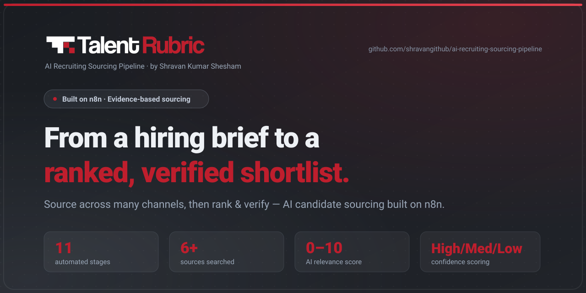
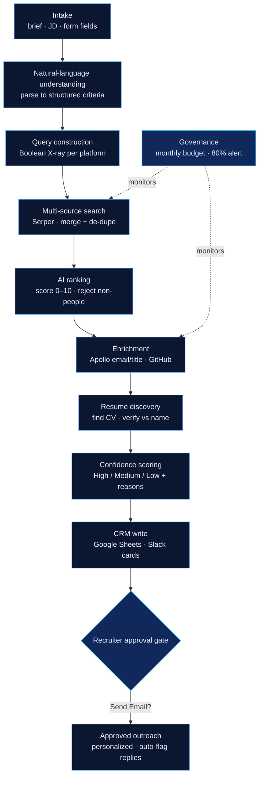

[](./LICENSE) [](https://github.com/shravangithub/ai-recruiting-sourcing-pipeline/stargazers) [](https://shravangithub.github.io/ai-recruiting-sourcing-pipeline/) [](https://n8n.io)

# AI Recruiting Sourcing Pipeline

**Built by Shravan Kumar Shesham · 2026** · [LinkedIn](https://www.linkedin.com/in/shravanskumar/) · Licensed under [MIT](./LICENSE)



▶ **[Watch the 3-minute demo](https://drive.google.com/file/d/1CyNN-onKTZ-8LBOsvo8TD3sbrm7-agEr/view?usp=sharing)** — see the pipeline turn a brief into a ranked, verified shortlist.

An evidence-based, AI-powered candidate sourcing and outreach system built on [n8n](https://n8n.io).

It turns a plain-English hiring brief (or an uploaded job description) into a ranked, enriched,
confidence-scored shortlist of real candidates — and manages recruiter-approved outreach end to end.

> **Why this exists.** Modern talent acquisition increasingly rewards recruiters who can *build*,
> not just operate an ATS. This project is my working proof of that: a production sourcing pipeline
> I designed, debugged, and hardened myself — with an emphasis on **data quality, judgment, and
> respecting the limits of automation**, not "AI will replace recruiters" hype.

---

## Quick links

- Live demo / docs: **[shravangithub.github.io/ai-recruiting-sourcing-pipeline](https://shravangithub.github.io/ai-recruiting-sourcing-pipeline/)** (source in `docs/index.html`)
- Importable n8n template: `ai-recruiting-pipeline.template.json`
- Release notes: [`RELEASES/v1.0.md`](RELEASES/v1.0.md)

---

## Table of contents

- [Pipeline architecture](#pipeline-architecture)
- [Key features](#key-features)
- [Getting started (3–5 minutes)](#getting-started-3-5-minutes)
- [Quick start (1–2 commands)](#quick-start-1-2-commands)
- [Install & usage](#install--usage)
- [Demo & assets](#demo--assets)
- [Troubleshooting / FAQ](#troubleshooting--faq)
- [Contributing](#contributing)
- [License](#license)

---

## Pipeline architecture

One pass, eleven stages — from a plain-English brief to recruiter-approved outreach, with a
governance layer watching API spend throughout.



---

## What it does (in one pass)

1. **Intake** — a recruiter submits a form: role, skills, location, seniority, exclusions, target
   platforms, geography, and (optionally) a full job description pasted or uploaded as PDF/Word.
2. **Natural-language understanding** — an LLM parses the free-text brief/JD into structured search
   criteria; explicit form fields always override the AI.
3. **Query construction** — a Boolean "X-ray" search string is built per target platform
   (LinkedIn, GitHub, Stack Overflow, etc.), with synonym expansion, exclusions, education filters,
   and a job-post noise filter so the search returns *people*, not job ads.
4. **Multi-source search** — paginated search (via [Serper](https://serper.dev)) across the selected
   platforms and the open web, results merged and de-duplicated.
5. **AI ranking** — every result is scored 0–10 against the criteria/JD, with a hard experience-minimum
   filter and explicit rules to reject job postings, directories, and non-person pages.
6. **Enrichment** — top candidates are enriched with verified work email/title/company (Apollo) and
   public GitHub profile data; LinkedIn-less candidates skip paid enrichment to save credits.
7. **Resume discovery** — a targeted secondary search hunts for a downloadable CV, scored for
   relevance and **verified against the candidate's name** before it's trusted.
8. **Confidence scoring** — every candidate gets a High/Medium/Low confidence label with reasons,
   so a recruiter knows which rows to trust.
9. **CRM write** — deduped candidates are upserted into a tracker (Google Sheets) with 25+ fields,
   plus per-candidate cards posted to Slack.
10. **Approved outreach** — the recruiter ticks "Send Email?" on chosen rows; a scheduler sends a
    personalized outreach email, marks the row "Contacted", and a mail trigger auto-flags "Replied".
11. **Governance** — monthly API-credit budget tracking with auto-reset and an 80% near-cap alert.

---

## Key features

- Boolean X-ray search automation (Google/Bing/X-ray queries)
- LLM-based ranking and scoring of candidate matches
- Data enrichment (profiles, company, contact where available)
- Confidence scoring and recruiter review flow
- Export to CSV/ATS and optional outreach automation

## Getting started (3–5 minute walkthrough)

1. Clone the repo
2. Open `docs/index.html` for a self-contained demo of flow and output
3. Import the n8n workflow into your n8n instance (see Install & usage below)

## Quick start (1–2 commands)

```bash
# clone and open demo in your browser (works locally)
git clone https://github.com/shravangithub/ai-recruiting-sourcing-pipeline.git
# open demo
xdg-open ai-recruiting-sourcing-pipeline/docs/index.html || open ai-recruiting-sourcing-pipeline/docs/index.html
```

## Install & usage

1. Install n8n: https://docs.n8n.io/getting-started/installation/
2. Start n8n and import the workflow from `ai-recruiting-pipeline.template.json` (n8n → **Import from File**).
3. Configure credentials (Google/Bing, LLM API key, enrichment API keys) in n8n credentials.
4. Run the pipeline and review ranked candidates in the final approval node.

## Demo & assets

- `docs/index.html` — static demo/landing page (also published via GitHub Pages).
- `assets/social-preview.svg` — social preview image (upload to repo Settings → Social preview).
- `assets/demo-placeholder.svg` — placeholder demo graphic (replace with a final GIF when ready).

## Troubleshooting / FAQ

Q: What LLMs are supported?
A: The pipeline uses a generic LLM ranking step — configure your preferred provider (OpenAI, Anthropic, or local model) by setting the provider credential in n8n.

Q: How do I scale to large volumes?
A: Use pagination in the search steps, batch enrichment requests, and consider a queue (Redis / n8n queue) for enrichment & scoring. Caching enrichment results reduces API usage.

## Contributing

Contributions welcome — see [CONTRIBUTING.md](CONTRIBUTING.md) for guidelines.

## License

This project is licensed under the MIT License — see [LICENSE](./LICENSE).
